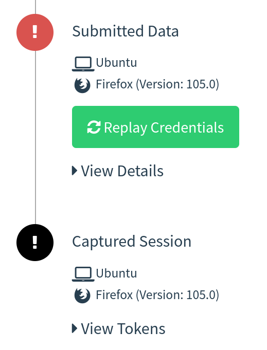
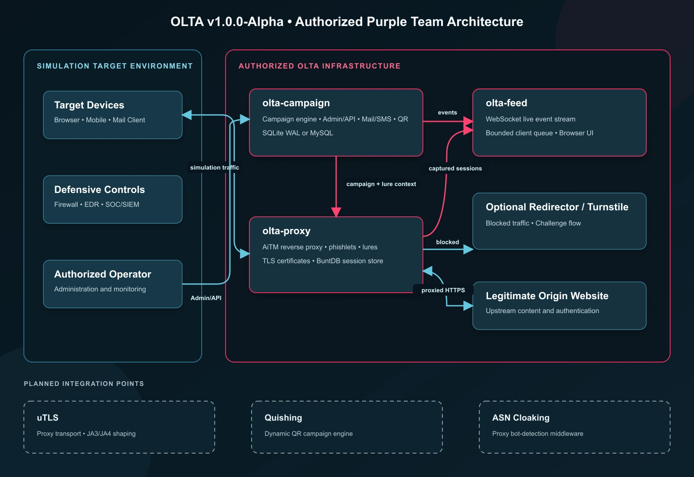
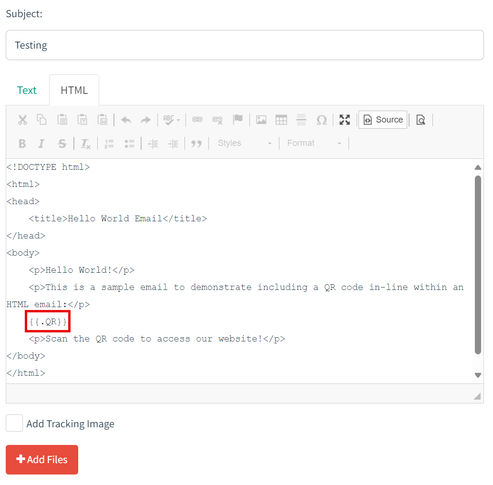
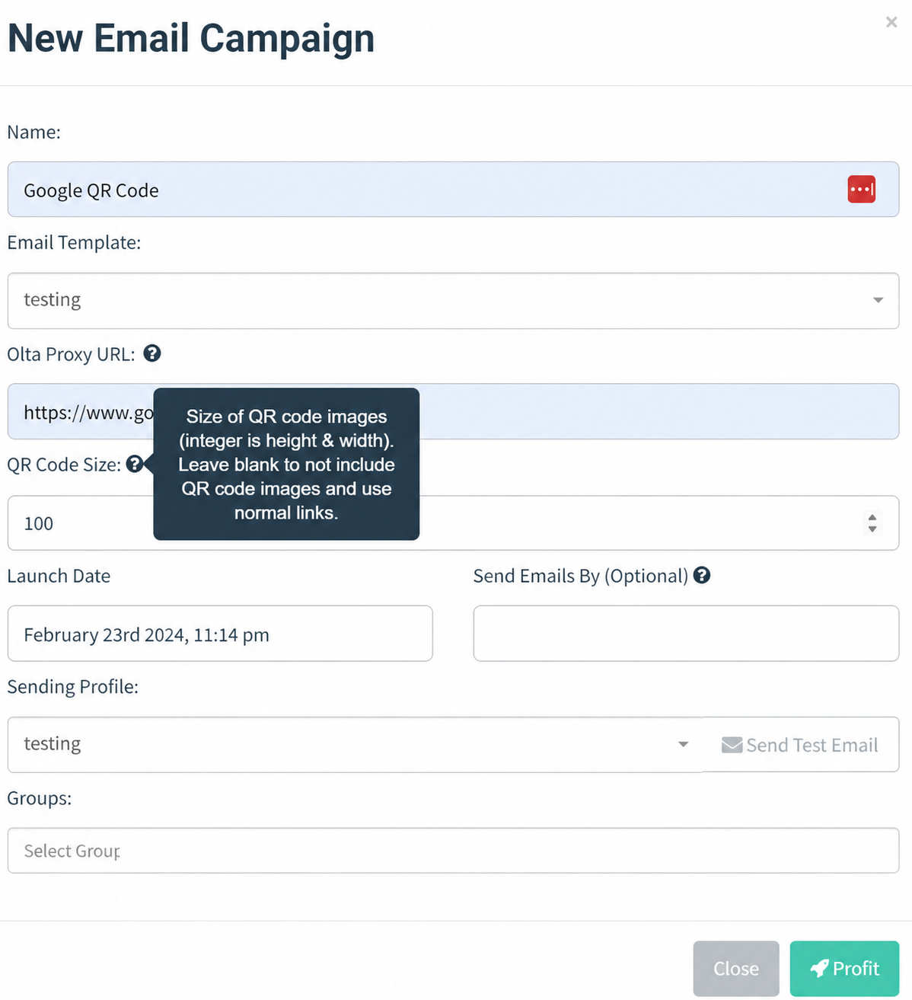
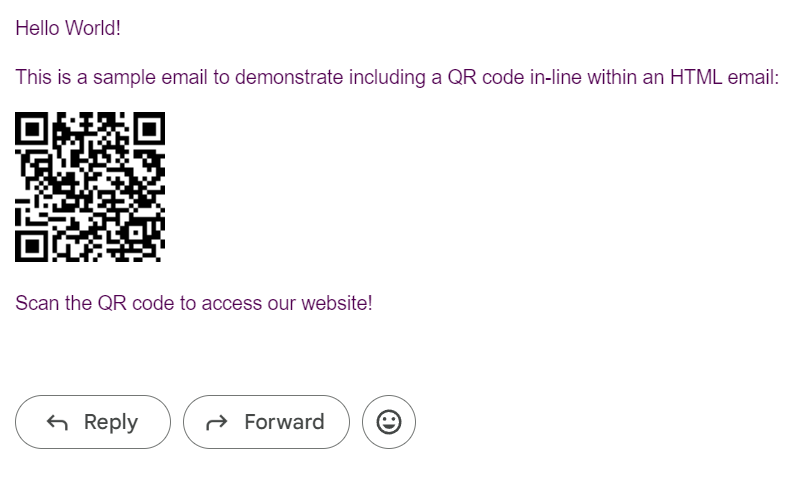
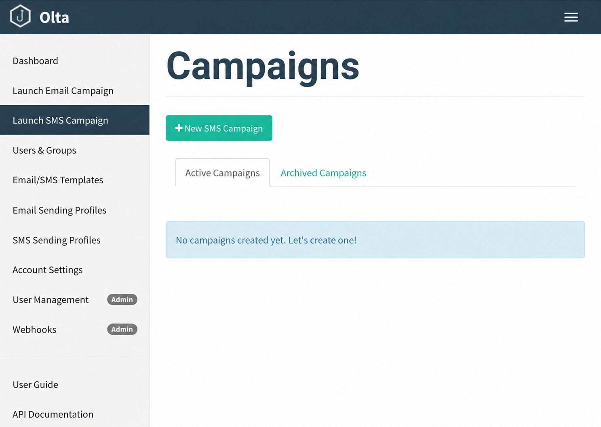
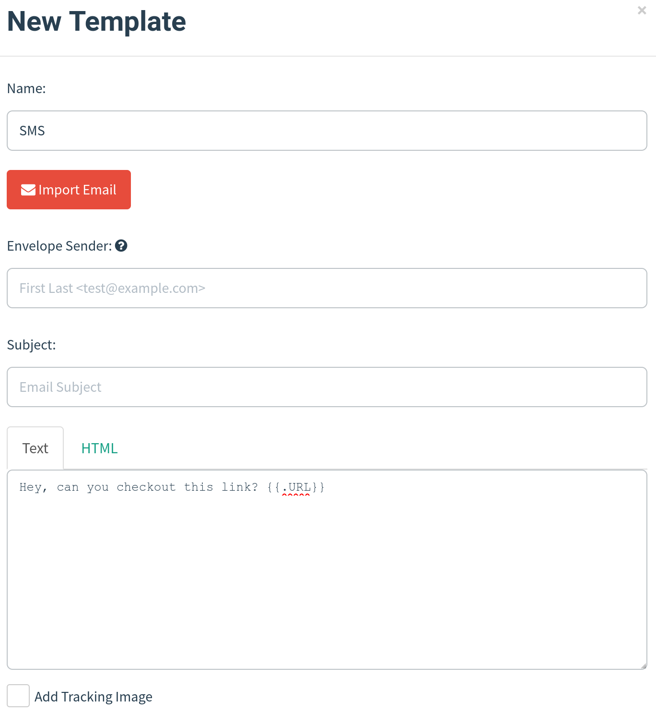
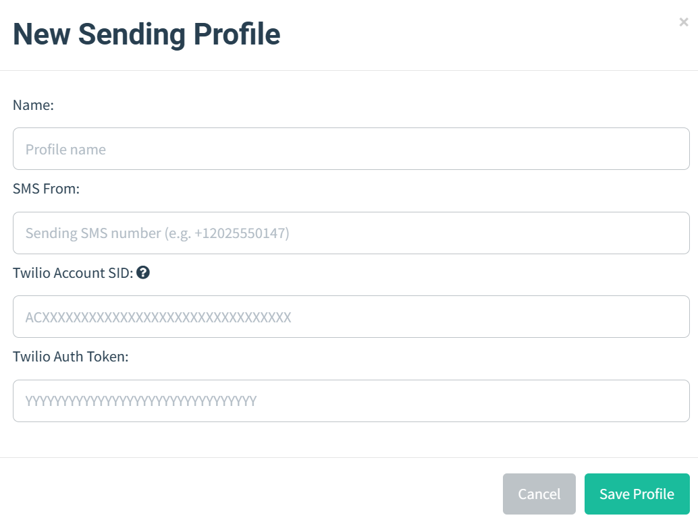
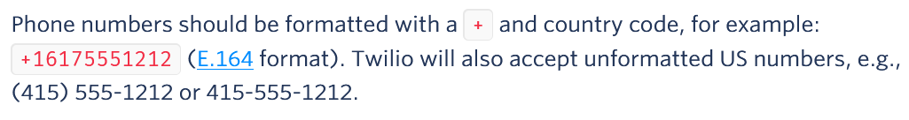
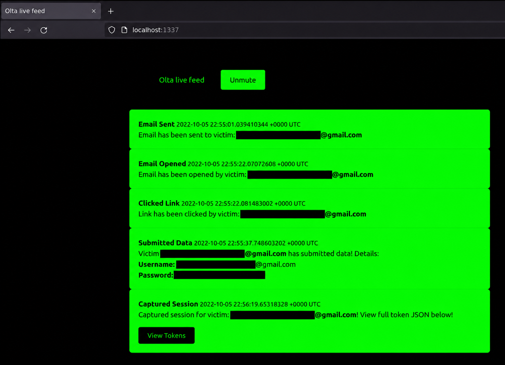

# Table of Contents

- [Olta](#olta)
  * [Olta v1 Architecture](#olta-v1-architecture)
  * [Releases](#releases)
  * [A Word About Sponsorship](#a-word-about-sponsorship)
  * [Credits](#credits)
  * [Prerequisites](#prerequisites)
  * [Disclaimer](#disclaimer)
  * [Why?](#why)
  * [Background](#background)
  * [Purple-Team Telemetry & Resilience Reporting](#purple-team-telemetry--resilience-reporting)
  * [Evasion & Detonation Engineering](#evasion--detonation-engineering)
  * [Social Engineering Toolkit](#social-engineering-toolkit)
  * [Infrastructure Layout](#infrastructure-layout)
  * [setup.sh](#setupsh)
  * [Cloudflare Turnstile Setup](#cloudflare-turnstile-setup)
  * [Cloudflare Turnstile HTML Template Guide](#cloudflare-turnstile-html-template-guide)
  * [replace_rid.sh](#replace_ridsh)
  * [Email Campaign Setup](#email-campaign-setup)
  * [QR Code Generator](#qr-code-generator)
  * [SMS Campaign Setup](#sms-campaign-setup)
  * [Live Feed Setup](#live-feed-setup)
  * [A Word About Phishlets](#a-word-about-phishlets)  
  * [A Word About The Evilginx3 Update](#a-word-about-the-evilginx3-update)
  * [Installation Notes](#installation-notes)
  * [A Note About Campaign Testing And Tracking](#a-note-about-campaign-testing-and-tracking)
  * [Changes to GoPhish](#changes-to-gophish)
  * [Changelog](#changelog)
  * [Issues and Support](#issues-and-support)
  * [Future Goals](#future-goals)
  * [Contributing](#contributing)

# Olta

Combination of [evilginx3](https://github.com/kgretzky/evilginx2) and [GoPhish](https://github.com/gophish/gophish), extended with a purple-team telemetry layer that turns captured engagement data into a defensive resilience report. Current version: `1.0.0-Alpha`.

## Olta v1 Architecture

Olta uses a single Go module (`github.com/s4l1hs/olta`) with three independently buildable services:

- `cmd/olta-proxy` provides the Evilginx-compatible reverse-proxy entry point, backed by `pkg/proxy`.
- `cmd/olta-campaign` provides campaign administration and delivery, backed by `pkg/campaign`.
- `cmd/olta-feed` provides the live WebSocket event feed, backed by `pkg/feed`.

Build all services from the repository root:

```sh
go build -o build/olta-proxy ./cmd/olta-proxy
go build -o build/olta-campaign ./cmd/olta-campaign
go build -o build/olta-feed ./cmd/olta-feed
```

Campaign database schemas are embedded in the campaign package. A fresh SQLite or MySQL database is initialized directly from the unified Olta schema in `pkg/campaign/migrations`; no runtime migration directory or historical migration replay is required. Existing databases must already match the final pre-Olta schema before they can be baselined as schema version 1.

## Releases

`build/` is a local output directory, not a distribution channel — it is `.gitignore`d and nothing under it is tracked in this repository. To produce a release build, run the three `go build` commands above from the repository root; each produces a single static binary for the host platform and Go toolchain in use.

Published releases attach the resulting `olta-proxy`, `olta-campaign`, and `olta-feed` binaries (plus any platform variants) as GitHub release artifacts, together with their checksums, rather than committing binaries into version control. Shipping unverifiable, pre-built binaries inside a security tool's repository is a supply-chain smell — nobody can confirm what a committed binary actually contains — so build-from-source-and-attach-to-the-release is the only distribution path this repository endorses.

# A Word About Sponsorship

This is the public, free version of the repository, **IT IS NOT THE LATEST VERSION**. I am purposefully keeping this public version of the repository behind my version for people that sponsor me via `GitHub Sponsors`. This means this version may be lacking bug fixes or features and there should be no expectations for bug fixes, adding features, or support here. [Become a sponsor](https://github.com/sponsors/fin3ss3g0d) to gain access to the latest version.

## Credits

Before I begin, I would like to say that I am in no way bashing [Kuba Gretzky](https://github.com/kgretzky) and his work. I thank him personally for releasing [evilginx3](https://github.com/kgretzky/evilginx2) to the public. In fact, without his work this work would not exist. I must also thank [Jordan Wright](https://github.com/jordan-wright) for developing/maintaining the incredible [GoPhish](https://github.com/gophish/gophish) toolkit. Kuba's [Gophish fork](https://github.com/kgretzky/gophish) was also used as inspiration for some parts of this project after creating his own integration.

## Prerequisites

You should have a fundamental understanding of how to use `GoPhish` and `evilginx3`.

## Disclaimer

I shall not be responsible or liable for any misuse or illegitimate use of this software. This software is only to be used in authorized penetration testing or red team engagements where the operator(s) has(ve) been given explicit written permission to carry out social engineering. 

## Why?

As a penetration tester or red teamer, you may have heard of `evilginx3` as a proxy man-in-the-middle framework capable of bypassing `two-factor/multi-factor authentication`. This is enticing to us to say the least, but when trying to use it for social engineering engagements, there are some pain points. 

1. Lack of tracking - `evilginx3` does not provide unique tracking statistics per victim (e.g. opened email, clicked link, etc.), this is problematic for clients who want/need/pay for these statistics when signing up for a social engineering engagement.

2. Not a full social engineering toolkit - `evilginx3` only provides proxy man-in-the-middle capabilities, it does not provide all of the functionality required for a social engineering campaign via email/SMS. For example, it does not send emails to targets or provide this functionality.

3. No GUI - do we really need to explain this one further? We all love our GUIs and the visual representation of data for a social engineering campaign is invaluable. Operators can really get a thorough understanding as to the success of their social engineering campaigns by being able to view a visual representation of the data.

## Background

In this setup, `GoPhish` is used to send emails and provide a dashboard for `evilginx3` campaign statistics, but it is not used for any landing pages. Your phishing links sent from `GoPhish` will point to an `evilginx3` lure path and `evilginx3` will be used for landing pages. This provides the ability to still bypass `2FA/MFA` with `evilginx3`, without losing those precious stats. Realtime campaign event notifications have been provided with a local websocket/http server I have developed and full usable `JSON` strings containing tokens/cookies from `evilginx3` are displayed directly in the `GoPhish` GUI (and feed):



## Purple-Team Telemetry & Resilience Reporting

Olta is not only an offensive simulation tool — it is built to hand an authorized client's SOC the same visibility into an engagement that a real attacker would have denied them. This is the platform's newest and most differentiating capability: a shared, ATT&CK-tagged event stream (`pkg/telemetry`) fed by all three services, and a per-campaign resilience report (`pkg/campaign/resilience`) computed from it.

### The event bus and the kill-chain stages

Every decision point in an engagement emits one canonical `Event` (`pkg/telemetry/event.go`) onto a nine-stage, MITRE ATT&CK-tagged kill chain:

| Stage | Technique | Meaning |
|---|---|---|
| `delivery` | T1566.002 Spearphishing Link | Message sent to a target |
| `open` | T1566.002 | Message opened |
| `lure` | T1566.002 | Phishing link clicked |
| `cloak` | T1090 Proxy | Cloaker matched and allowed/blocked/redirected the request |
| `verify` | T1497 Virtualization/Sandbox Evasion | Client-side browser assertion evaluated |
| `credential` | T1056.003 Web Portal Capture | Credentials submitted through the proxied page |
| `capture` | T1539 Steal Web Session Cookie | Session cookie/token captured |
| `replay` | T1550.004 Web Session Cookie | Captured session validated for continued replayability |
| `report` | *(defender signal, no technique)* | A human reported the phish via the IMAP monitor |

`CampaignID` and `RID` are optional on an `Event`: the `cloak` and `verify` stages fire from the proxy before lure validation ever establishes who the recipient is, so they are recorded unattributed rather than dropped.

Events are published through a `Bus` (`pkg/telemetry/bus.go`) that fans each event out to every configured sink from a dedicated goroutine. Emission never blocks or fails the request path — a full queue drops and counts the event rather than stalling a victim-facing HTTP response, the same non-blocking discipline already used by `campaignstore`'s database queue and the feed hub's broadcast.

Four sinks consume the stream, any combination of which can be wired in:

- **`campaigndb`** — the store of record, writing to a new `telemetry_events` table (campaign schema migration 6) through the existing `campaignstore` queue.
- **`webhook`** — the existing Slack/Discord/generic JSON dispatcher, generalized from validation-only alerts to any `Event`.
- **`feed`** — publishes a versioned `telemetry.v1` message to the live `olta-feed` WebSocket for real-time operator visibility.
- **`jsonl`** — appends newline-delimited JSON to an owner-only (`0600`), append-only file, set with the `-telemetry-file` flag on `olta-proxy`.

### The no-loot invariant

**An `Event` never carries captured credentials, cookies, or session tokens.** Captured material stays in the campaign database behind the `pkg/campaign/secrets` AES-GCM layer; telemetry only ever records the *fact* of a capture — which stage, what outcome, which technique, when, and a non-sensitive actor (IP, ASN, organization, user agent, country, TLS client profile). That separation is what makes the stream safe to hand directly to a client's SOC.

This is enforced structurally, not by convention. `Event.WithDetail` — the only way to attach stage-specific detail — admits scalars only (`string`, `bool`, any integer or float kind); maps, slices, structs, and pointers are rejected outright and replaced with a type marker. The reasoning is explicit in the code: a composite value can hide a secret behind a custom `MarshalJSON` that collapses it into an innocuous-looking unkeyed string, or behind a non-string map key that no key-based rule would ever match — both were demonstrated against an earlier, traversal-based implementation. Refusing composites removes the traversal entirely, and with it that whole class of bypass. On top of that, `WithDetail` still redacts by key as a backstop (`password`, `token`, `secret`, `cookie`, `credential`, `auth`, `otp`, `mfa`, `api_key`, `session_id`, `set_cookie`, and related tokens all redact to `[redacted]`).

### The resilience engine

`GET /api/campaigns/{id}/resilience` computes a `resilience.Report` for one campaign:

- **Kill-chain funnel** — for each of the eight attacker-side stages (`delivery` through `replay`), the number of distinct targets that reached it, labeled with its ATT&CK technique. A stage is counted by distinct `RID`, or by a derived actor identity (IP, then ASN/organization) for the unattributed `cloak`/`verify` stages, so one browser retrying dozens of blocked requests still counts as one target.
- **Defensive friction** — cloaker `blocked`/`redirected` decisions grouped by network owner and ASN. A burst of requests from a security vendor's or cloud provider's ASN shortly after delivery is direct evidence the target's own security stack detonated the link — a real finding about the client's defenses, derived from data the proxy already collects and previously discarded.
- **The report-vs-capture race** — for every target that was delivered to (the fixed denominator), whether they reported the phish before their session was captured, after it was captured, or never reported at all, plus the median time-to-report measured from delivery (not from click — a defender's clock starts when the message lands). This is the headline defensive metric: it measures whether the human layer beat the attacker, using only data Olta already collects, and it is honest about what it cannot see — Olta has no visibility into a client's SIEM and does not claim to.

A companion `GET /api/campaigns/{id}/resilience/navigator` endpoint exports the same technique/outcome data as a MITRE ATT&CK Navigator layer (`domain: "enterprise-attack"`, layer/navigator/ATT&CK versions embedded) that loads without manual editing.

**Be aware of the report's honest limits.** Three funnel stages depend on optional proxy features: `cloak` requires `-enable-cloaker`, `verify` requires `-enable-js-inspect`, and `replay` requires `-enable-session-validator`. When a feature was disabled, its stage renders as **"not measured"**, never as zero — a disabled stage reporting zero would misleadingly read as "nothing was blocked" when the truth is "nothing was watching." Separately, unattributed `cloak`/`verify` events (no RID resolved yet) are folded into a campaign's report by bounding them to the campaign's active time window (launch date through completion, or now for an in-flight campaign) rather than by a hard campaign ID — this is an approximation, and it may include cloak/verify traffic from other campaigns running concurrently on the same proxy install during that same window.

### Telemetry configuration

`cmd/olta-campaign/config.json` carries a `telemetry` block:

```json
"telemetry": {
    "cloaker": false,
    "verify": false,
    "session_validator": false
}
```

These three flags should mirror exactly how `olta-proxy` was actually launched (`-enable-cloaker`, `-enable-js-inspect`, `-enable-session-validator`), because they are what the resilience report uses as its baseline "was this stage even measured" claim. The two directions of drift are not symmetric: a stale `false` self-corrects, because one or more observed events for that stage is hard proof the feature ran (the cloaker only emits a `cloak` event when it matched a request, `jsinspect` only emits `verify` when browser verification is on) — so the report upgrades that stage to measured on its own. A stale `true`, by contrast, never self-corrects: the absence of events proves nothing, since an enabled feature can legitimately see zero matches, so a `true` that no longer matches reality stays wrong until an operator fixes it. Keeping this block in sync with the actual `olta-proxy` flags remains the operator's responsibility.

## Evasion & Detonation Engineering

### uTLS client profiles

Outbound proxy connections are transported through a uTLS-backed client (`pkg/proxy/transport/utls`) that presents a real browser's ClientHello fingerprint instead of Go's default `crypto/tls` signature. Four profiles are available via the `-client-profile` flag on `olta-proxy` (default `Chrome`):

- `Chrome` — current Chrome ClientHello
- `Firefox` — current Firefox ClientHello
- `Safari` — uTLS's current iOS Safari ClientHello
- `Random` — rotates between the modern browser presets on every new connection

### Smart cloaking & IP sync

`pkg/proxy/middleware/asncloak` classifies inbound requests against cloud provider and known security-crawler network ranges using a lock-free, immutable radix trie for IPv4/IPv6 CIDR and ASN longest-prefix matching — a lookup examines at most 32 trie nodes for IPv4 or 128 for IPv6, with no locks on the hot path. The CHANGELOG reports this local matching benchmarked at sub-microsecond latency with zero allocations. Matches can trigger a 302 redirect (default, to a configurable safe URL) or a 403/404 block, and are combined with suspicious-user-agent and required-browser-header heuristics.

The bundled default table covers Microsoft Azure, AWS, Google Cloud, DigitalOcean, Proofpoint, and Palo Alto Cortex Xpanse ranges, and is kept current by a background synchronizer (`pkg/proxy/middleware/asncloak/sync.go`) that periodically pulls the official AWS (`ip-ranges.amazonaws.com`), Google Cloud (`gstatic.com/ipranges`), and Microsoft Azure published ranges, plus a continuity fallback list for Palo Alto's scanning ranges when its documentation endpoint is unreachable. Updates publish atomically through a lock-free pointer swap, so lookups never block on a refresh in progress. Enabled by default via `-enable-ip-sync`, with a 12-hour refresh interval configurable through `-ip-sync-interval`.

### JS environment inspection

`pkg/proxy/middleware/jsinspect` injects a small client-side script that asserts whether the visiting browser looks automated: WebDriver/`navigator.webdriver` presence, headless indicators, a software (rather than hardware) WebGL renderer detected via regex against known software-renderer signatures (SwiftShader, LLVMpipe, Mesa), and canvas-fingerprint consistency across repeated draws. A suspicious assertion can trigger the same redirect-or-block enforcement as the cloaker. Enabled via `-enable-js-inspect`, with the injection/report endpoint configurable through `-js-inspect-endpoint`.

## Social Engineering Toolkit

### Quishing (QR code phishing)

`pkg/campaign/quishing` generates QR codes entirely in memory — no temporary files touch disk. A `Generate` call returns a Base64-encoded PNG payload, a ready-to-use `data:` URI, and inline MIME attachment data in one pass, with configurable image size, foreground/background color, and Low/Medium/High error correction. `{{.QRCode}}` and `{{.RIdQR}}` email template tags and an authenticated `POST /api/quishing/preview` dashboard endpoint expose it. See [QR Code Generator](#qr-code-generator) below for the walkthrough.

### Browser-in-the-Browser (BITB) and OAuth consent

`pkg/campaign/bitb` renders a simulated browser window — draggable chrome, a fake address bar, and HTTP/HTTPS status indicators — themed to match Windows 11 (light/dark), macOS (light/dark), or Linux/Ubuntu GNOME, either explicitly or auto-detected from the visiting client's platform. `{{.BITBFrame}}` and `{{.BITBFrameTheme}}` template helpers embed it directly into a phishing page.

`pkg/campaign/oauthconsent` renders matching OAuth 2.0 / OpenID Connect consent UI components — application and publisher branding, the requested scope list, redirect URI metadata, and accept/cancel event hooks — exposed through the `{{.OAuthConsent}}` template helper. Both components ship their CSS/JS as embedded assets served from the single campaign binary under `/static/components/`, so no separate static file deployment step is required.

### Multilingual spintax and role routing

`pkg/campaign/personalizer` combines three pieces: a concurrency-safe nested spintax evaluator that expands `{a|b|c}`-style variation while preserving Go template actions and ordinary HTML/CSS braces (benchmarked in the CHANGELOG at roughly 496 ns/op on Apple M2 hardware); an embedded scenario library across four locales — `en`, `tr`, `de`, `es` — and four categories (student, general HR, finance, IT), selectable at runtime via `--custom-templates-dir` overrides; and role-based routing that maps a recipient's department/position/role metadata to the matching category, falling back to general HR when nothing matches. Multi-variant campaign templates additionally support deterministic round-robin A/B assignment with per-variant delivery, open, click, submission, and capture metrics.

## Infrastructure Layout



Editable architecture sources are available as [Draw.io](diagram/Diagram.drawio) and [SVG](diagram/olta-architecture.svg).

- `evilginx3` will listen on an externally accessible address on port `443` (or whatever port you choose in `evilginx3` configuration)
- `GoPhish` will listen locally on port `8080` and `3333` (phishing server on port `8080` is not used)
- `Cloudflare Turnstile` server will listen locally on port `80`

## setup.sh

`setup.sh` has been provided to automate the needed configurations for you. Once this script is run and you've fed it the right values, you should be ready to get started. Below is the setup help:

```
Usage:
./setup <root domain> <subdomain(s)> <root domain bool> <feed bool> <rid replacement>
 - root domain                     - the root domain to be used for the campaign
 - subdomains                      - a space separated list of evilginx3 subdomains, can be one if only one
 - root domain bool                - true or false to proxy root domain to evilginx3
 - feed bool                       - true or false if you plan to use the live feed
 - rid replacement                 - replace the gophish default "rid" in phishing URLs with this value
Example:
  ./setup.sh example.com "accounts myaccount" false true user_id
```

## Cloudflare Turnstile Setup

`Cloudflare Turnstile` integration has superseded redirect rules and an IP blacklist with `Apache2`. The `Apache2` approach relied on a predefined list of redirect rules and an IP blacklist. We may miss certain user agents, hosts, or IP addresses that end up detecting our infrastructure. This is usually done through bots and automated software that scans phishing infrastructure. `Cloudflare Turnstile` technology is one of the best defenses against bots at the time of writing and verifying an actual user is accessing your site.

1. Create a Cloudflare account
2. Select the `Turnstile` tab in the dashboard
3. Add a new site and use the domain for your phishing site/campaign
4. Edit the `cmd/olta-proxy/templates/forbidden.html` & `cmd/olta-proxy/templates/turnstile.html` files with your own changes
5. When starting `olta-proxy`, include the public/private keys with the `turnstile` flag separated by a `:`. For example:

```Bash
./olta-proxy -feed -g ../olta-campaign/olta-campaign.db -turnstile <PUBLIC_KEY>:<PRIVATE_KEY>
```

Blog post [here](https://fin3ss3g0d.net/index.php/2024/04/08/evilgophishs-approach-to-advanced-bot-detection-with-cloudflare-turnstile/).

## Cloudflare Turnstile HTML Template Guide

If I were to include a static HTML page for the `Cloudflare Turnstile` functionality, everyone's phishing infrastructure would have the same page and it would lead to static HTML code detections. *In comes Go HTML templates*. I have included a starter template in `cmd/olta-proxy/templates/turnstile.html` as a guideline **YOU WANT TO CHANGE THIS**. Here are the rules around how the template code is setup, failure to follow these rules will likely result in breaking the `Cloudflare Turnstile` functionality:

1. You must include the `{{.FormActionURL}}`, `{{.ErrorMessage}}`, and `{{.TurnstilePublicKey}}` template variables
2. The form action URL for submitting the `Turnstile` challenge must be the `{{.FormActionURL}}` template variable
3. The `data-sitekey` value for the `cf-turnstile` `div` class must be the `{{.TurnstilePublicKey}}` template variable
4. You must save the template at `cmd/olta-proxy/templates/turnstile.html`
5. The button to submit the challenge form must have its name attribute equal `button`

## replace_rid.sh

In case you ran `setup.sh` once and already replaced the default `RId` value throughout the project, `replace_rid.sh` was created to replace the `RId` value again.

```
Usage:
./replace_rid <previous rid> <new rid>
 - previous rid      - the previous rid value that was replaced
 - new rid           - the new rid value to replace the previous
Example:
  ./replace_rid.sh user_id client_id
```

## Email Campaign Setup

Once `setup.sh` is run, the next steps are: 

1. Start `GoPhish` and configure email template, email sending profile, and groups
2. Start `evilginx3` and configure phishlet and lure (must specify full path to `GoPhish` `sqlite3` database with `-g` flag)
3. Launch campaign from `GoPhish` and make the landing URL your lure path for `evilginx3` phishlet
4. **PROFIT**

## QR Code Generator

The `QR Code Generator` feature allows you to generate QR codes to deploy QR code social engineering campaigns. Here are the steps to use it:

1. When editing an email HTML template, you can now include the `{{.QR}}` template variable:



2. When starting a new campaign, enter a size for the QR code images:



3. The outcome will be similar to the following, but you can adjust the size to meet your needs:



4. **PROFIT**

*Note that this feature is only supported for email campaigns and HTML email templates at the moment*

Blog post [here](https://fin3ss3g0d.net/index.php/2024/02/24/qr-code-phishing-with-evilgophish/).

## SMS Campaign Setup

An entire reworking of `GoPhish` was performed in order to provide `SMS` campaign support with `Twilio`. Your new `Olta` dashboard will look like below:



Once you have run `setup.sh`, the next steps are:

1. Configure `SMS` message template. You will use `Text` only when creating a `SMS` message template, and you should not include a tracking link as it will appear in the `SMS` message. Leave `Envelope Sender` and `Subject` blank like below:



2. Configure `SMS Sending Profile`. Enter your phone number from `Twilio`, `Account SID`, and `Auth Token`:



3. Import groups. The `CSV` template values have been kept the same for compatibility, so keep the `CSV` column names the same and place your target phone numbers into the `Email` column. Note that `Twilio` accepts the following phone number formats, so they must be in one of these three:



4. Start the `olta` proxy binary and configure phishlet and lure (must specify full path to `GoPhish` `sqlite3` database with `-g` flag)
5. Launch campaign from `GoPhish` and make the landing URL your lure path for `evilginx3` phishlet
6. **PROFIT**

Blog post [here](https://fin3ss3g0d.net/index.php/2024/03/04/smishing-with-evilgophish/).

## Live Feed Setup

Realtime campaign event notifications are handled by a local websocket/http server and live feed app. To get setup:

1. Select `true` for `feed bool` when running `setup.sh`

2. `cd` into `cmd/olta-feed` and start the app with `./olta-feed`

3. When starting `olta-proxy`, supply the `-feed` flag to enable the feed. For example:

`./olta-proxy -feed -g /opt/olta/cmd/olta-campaign/olta-campaign.db`

4. You can begin viewing the live feed at: `http://localhost:1337/`. The feed dashboard will look like below:



**IMPORTANT NOTES**

- The live feed page hooks a websocket for events with `JavaScript` and you **DO NOT** need to refresh the page. If you refresh the page, you will **LOSE** all events up to that point.

## A Word About Phishlets

I will add `phishlets` to this repository at my own discretion. There should be no expectation of me creating `phishlets` as part of this repository, you are expected to create your own. ***DO NOT OPEN ISSUES IN THIS REPOSITORY FOR PHISHLETS***

## A Word About The Evilginx3 Update

On `May 10, 2023` [Kuba Gretzky](https://github.com/kgretzky) updated `evilginx` `2.4.0` to version `3.0.0`. You can find a detailed blog post about changes to the tool here: [evilginx3+mastery](https://breakdev.org/evilginx-3-0-evilginx-mastery/). Most notably, changes to the `phishlet` file format will most likely break `phishlets` before version `3.0.0` and they will have to be rewritten. While it may be work to rewrite them, there are added benefits with the new `phishlet` file format. Documentation on the `phishlet` format for version `3.0.0` can be found here: [Phishlet Format v3.0.0](https://help.evilginx.com/docs/phishlet-format). `Phishlets` in the legacy format will still be kept in this repository in the folder `cmd/olta-proxy/legacy_phishlets`. `Phishlets` compatible with version `3.0.0` will be stored in `cmd/olta-proxy/phishlets`. Not all of the legacy `phishlets` have been converted to version `3.x.x` format yet, I will continue to update them as time allows!

## Installation Notes

The installation script was tested on Ubuntu Focal/Jammy and installs the latest version of `Go` from source. Binaries may fail to build depending on your `Go` environment and what you have installed i.e. installing the original versions this project combines then trying to install this version of them. It also makes changes to DNS so `evilginx3` can take it over. You should understand the implications of this and review it. A fresh environment is recommended and other operating systems haven't been tested.

## A Note About Campaign Testing And Tracking

It is not uncommon to test the tracking for a campaign before it is launched and I encourage you to do so, I will just leave you with a warning. `evilginx3` will create a cookie and establish a session for each new victim's browser. If you continue to test multiple campaigns and multiple phishing links within the same browser, you will confuse the tracking process since the `RId` value is parsed out of requests and set at the start of a new session. If you are doing this, you are not truly simulating a victim as a victim would never have access to another phishing link besides their own and goes without saying that this will never happen during a live campaign. This is to fair warn you not to open an issue for this as you are not using the tool the way it was intended to be used. If you would like to simulate a new victim, you can test the tracking process by using a new browser/tab in incognito mode.

## Changes to GoPhish

`GoPhish` is never used in any of your actual phishing pages and email headers have been stripped, so there's no need to worry about IOCs within it.

1. Default `rid` string in phishing URLs is chosen by the operator in `setup.sh`
2. Added `SMS` Campaign Support
3. Added additional `Captured Session` campaign event for captured `evilginx3` sessions/tokens

## Changelog 

See the `CHANGELOG.md` file for changes made since the initial release.

## Issues and Support

There should be no expectation for me to respond to issues in this public version of the repository. You're not sponsoring me or funding the development of the project, so there should be no expectations for support. [Sponsor me](https://github.com/sponsors/fin3ss3g0d) for increased support.

## Future Goals

- Additions to IP blacklist and redirect rules
- Convert legacy phishlets to `evilginx` `3.x.x` format
- Add more phishlets

## Contributing

I would like to see this project improve and grow over time. If you have improvement ideas, new redirect rules, new IP addresses/blocks to blacklist, phishlets, or suggestions, please open a pull request.
